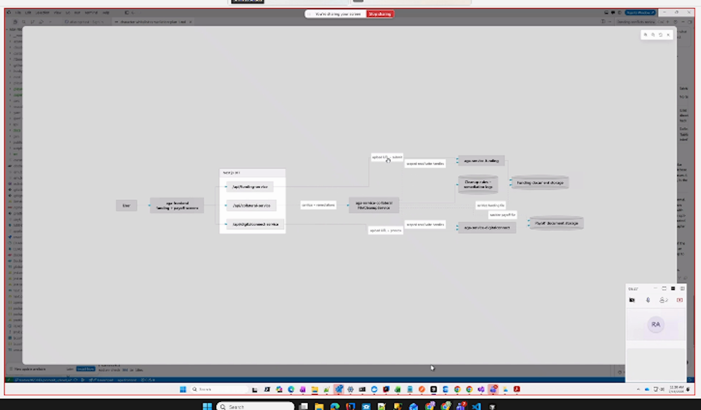
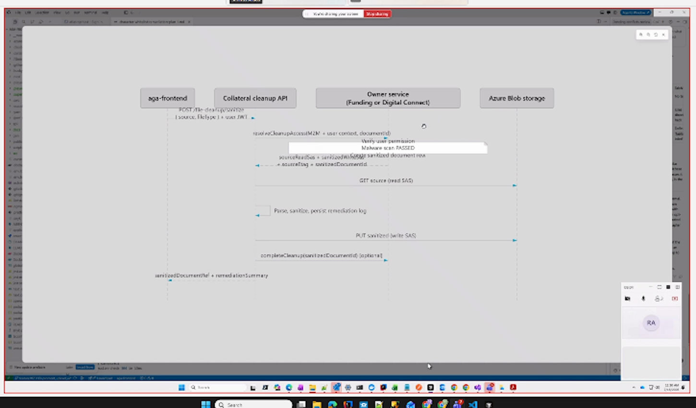
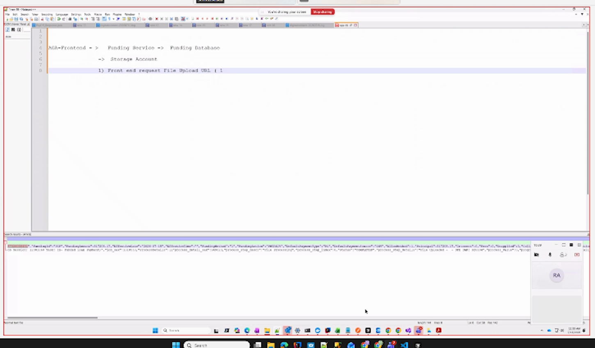
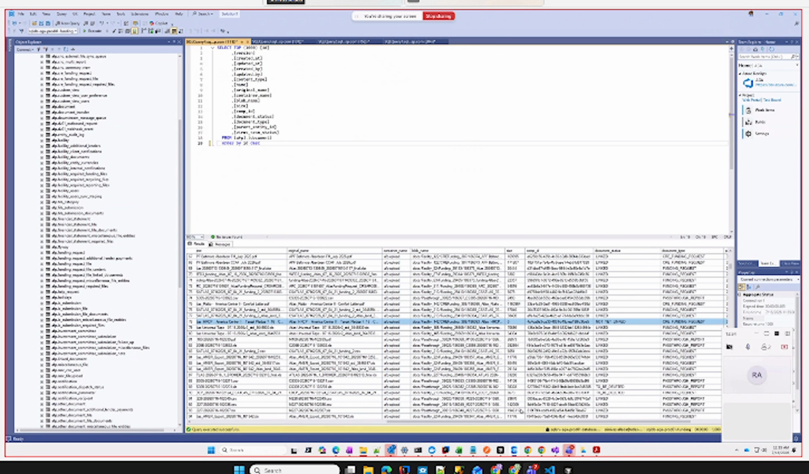
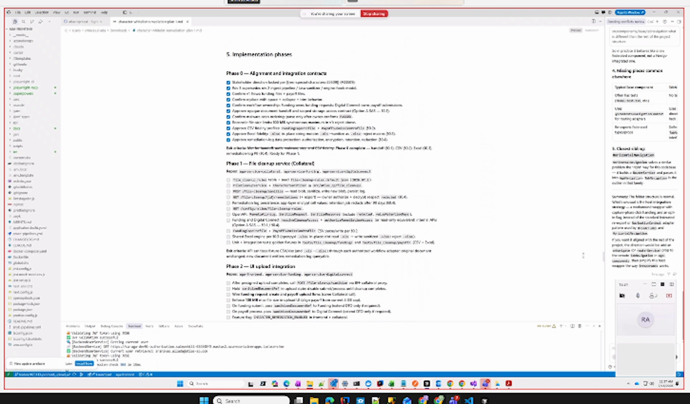

# Srini Character Whitelist Part 2

Date: 2026-07-16

Source: `2026-07-16-Srini-character-whitelist-p2.mp4`

## Main conclusion

The proposed architecture needs to be revised. File sanitization should occur immediately after the frontend uploads the file to Azure Blob Storage and before the user submits the funding or payoff request.

## Decisions

- Use the Collateral cleanup service as the shared sanitization service for Funding, Payoff, Digital Connect, and future consumers.
- Keep sanitization outside the Funding and Payoff business workflows.
- Do not include malware scanning in this cleanup flow.
- Store cleanup and character rules in the Collateral database as dynamic configuration rather than hard-coded logic.
- Maintain default cleanup rules while allowing the rules to change over time.
- Redraw the architecture and sequence diagrams to reflect the actual upload lifecycle.

## Current workflow confirmed

1. The frontend requests an upload URL from Funding.
2. Funding creates an initial document record and returns a document ID and SAS URL.
3. The frontend uploads the file directly to Azure Blob Storage.
4. The document is not linked to the funding request until the user submits.
5. On submission, Funding updates the document record with the storage path and related metadata.

## Intended workflow

1. The frontend obtains the document ID and SAS URL.
2. The frontend uploads the original file to Blob Storage.
3. Before submission, the frontend invokes the Collateral cleanup service.
4. Collateral reads the uploaded file, applies the configured cleanup rules, and writes the sanitized result.
5. After sanitization succeeds, the frontend submits the sanitized document information to Funding or Payoff.

## Key insights

- A document ID exists before submission, but the document is not yet linked to its owning funding or payoff request. This is the central constraint the design must address.
- Having Collateral call Funding, Payoff, or Digital Connect to rediscover the file would introduce unnecessary coupling and service communication.
- The preferred direction is to provide Collateral with the document or blob location and narrowly scoped storage access when cleanup is requested.
- Since cleanup happens before submission, the design must account for abandoned uploads, retries, and duplicate cleanup requests.
- Dynamic rules require a defined schema, versioning approach, and clear defaults. The current design does not yet specify these details.

## Open decisions and actions

- Determine how Collateral securely receives read and write access before the document is linked to a business request.
- Test the existing code to confirm that the document ID and storage information are available at the required point.
- Decide whether the frontend passes scoped SAS details directly or whether an owner service resolves access through an authenticated endpoint.
- Define the configurable rule model, including allowed code points, replacement behavior, defaults, and rule scope.
- Define behavior for Collateral outages, sanitization failures, duplicate requests, and retries.
- Update both the architecture diagram and the state or sequence diagram.
- Srini will send his detailed feedback points by email.

## Key timestamps

- 05:12: Current upload architecture
- 06:05: Required sanitization timing
- 08:26: Existing workflow walkthrough
- 11:37: Pre-submit document state
- 13:25: Configurable rules

## Key images

### Proposed architecture at 05:18

### Cleanup sequence at 06:55

### Current upload workflow at 09:30

### Pre-submit document records at 11:45

### Implementation plan and design considerations at 14:15

