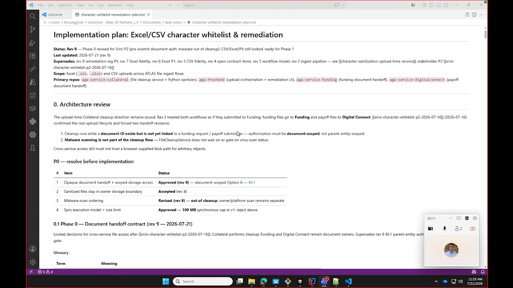
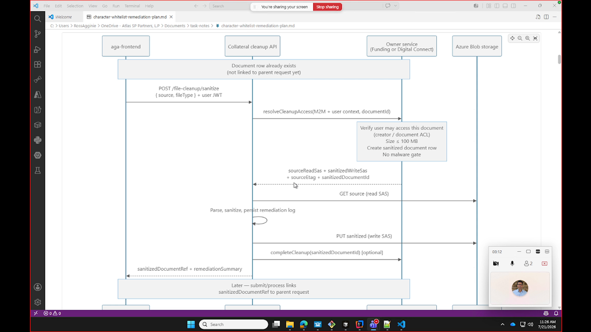
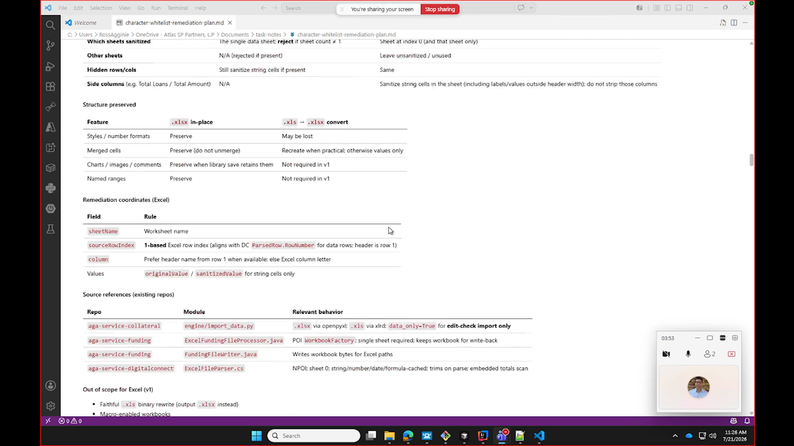
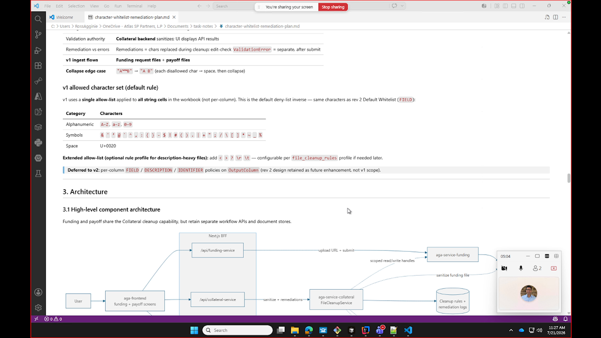
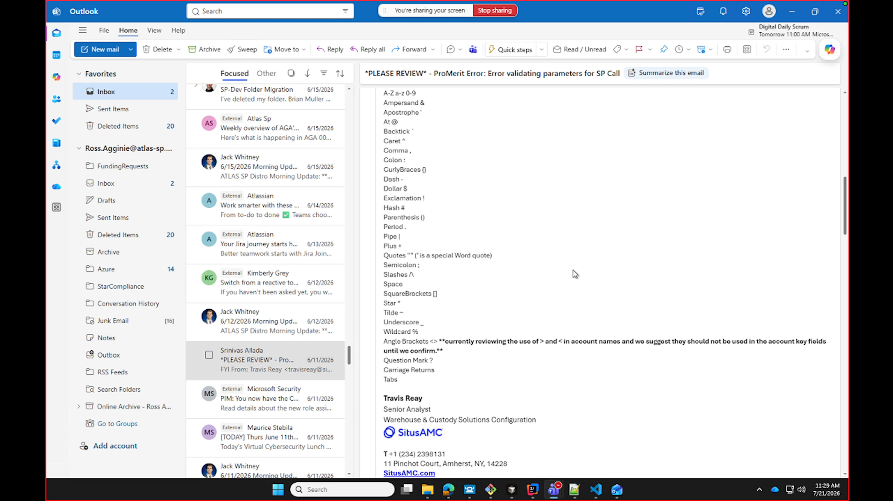

# Srini Character Whitelist Part 3

Date: 2026-07-21

Source: `2026-07-21-Srini-character-whitelist-p3.mp4` (6:14, screen share of `character-whitelist-remediation-plan.md`, Rev 9)

Participants: Ross Agginie (presenting the revised design) and Srini (reviewer). Two people on the call.

## Main conclusion

Srini approved the two structural items from Part 2 (short-lived SAS handoff and the sequence flow), but rejected one scoping decision: per-column rule profiles (default vs. description) must move from v2 into **v1 scope**. The current plan defers `FIELD` / `DESCRIPTION` / `IDENTIFIER` per-column policies to v2, and Srini says that is the core requirement and cannot wait. He also flagged an existing payoff-side sanitization step that is missing from the rules. He will follow up by email and code pointer, then do a final review.

## What Srini approved

- **SAS-based cleanup access.** The file owner (Funding or Digital Connect) issues Collateral a short-lived SAS granting both read and write. Collateral reads the source, sanitizes, and writes the result back using those short-lived credentials. Ross had hoped to avoid handing Collateral storage access but concluded there is no clean way to; Srini agreed: "The problem is I'm thinking if we can avoid it, but it doesn't look like it's an easy way to avoid it... I think that is fine."
- **The cleanup sequence** as drawn (POST /file-cleanup/sanitize -> resolveCleanupAccess -> read/sanitize/write -> return sanitizedDocumentRef). Document-scoped authorization, 100 MB synchronous cap, and no malware gate in the cleanup path all carried over from Part 2 and remain accepted.

## What Srini rejected / must change

### 1. Per-column rule profiles must be v1, not v2 (the main issue)

The plan's "v1 allowed character set" section applies a single default allow-list to **all** string cells and marks per-column `FIELD` / `DESCRIPTION` / `IDENTIFIER` policies as "Deferred to v2 ... not v1 scope."

Srini pushed back directly:
- The email he sent defines **two distinct rule sets**: a default/field whitelist, and a broader **description whitelist** that permits additional special characters.
- "Yeah, but it says it's deferred to V2, right? Why are we deferring? Because that's the main requirement... That should be V1."
- So v1 must support at least two profiles (default vs. description) and apply the correct one per column.

**How to identify a description column:** Srini noted that not every column is a description, so the system needs to categorize columns. Ross's answer: "Collateral already has a schema, so it should be able to figure it out" - i.e., use Collateral's existing schema/column metadata to map a column to the description profile rather than requiring manual configuration.

### 2. Missing payoff sanitization rule

There is additional file sanitization already happening in the **payoff** flow ("we're kind of stripping out" certain content) that is not represented in the configured rules. Srini wants that existing behavior captured as a rule in this design so it is not lost. He will send the exact code location: "I'll give you the exact point of code, right? In payoff, what we're doing."

## Action items

- [ ] **Ross:** Pull per-column rule profiles (default vs. description) into v1. Support both the default/field whitelist and the broader description whitelist from Srini's email. Move this out of the "Deferred to v2" note.
- [ ] **Ross:** Design column categorization so a column can be classified as a description column, leveraging Collateral's existing schema rather than manual config.
- [ ] **Ross:** Add the existing payoff-side sanitization/stripping behavior into the configured rule set.
- [ ] **Srini:** Forward the whitelist email and point to the exact spot (default vs. description character sets).
- [ ] **Srini:** Send the exact payoff code location showing the current stripping behavior.
- [ ] **Both:** Srini will do a final review once the two items (description profile + payoff rule) are handled - "if you have those two, then I think we are pretty much good."

## Key insights

- The design is close to done. Srini framed only two blockers; everything architectural from Part 2 is now settled.
- The per-column requirement is grounded in a real production ticket, not theory: the referenced email is a ProMerit "Error validating parameters for SP Call" thread with an explicit character whitelist, including a description-specific whitelist and a note that angle brackets `< >` in account key fields are still under review (see screenshot 5).
- Reusing Collateral's existing schema to detect description columns avoids a manual per-column configuration burden and keeps the rule engine data-driven, consistent with the Part 2 decision to store rules as dynamic configuration.
- Watch for scope creep: what was scoped as a v2 enhancement is now v1, so the rule model (schema, profiles, defaults) needs to be finalized before Phase 1 build.

## Source document snapshot (Rev 9)

The `character-whitelist-remediation-plan.md` shown was Rev 9, "Phase 0 revised for Srini P2 (pre-submit document auth; malware out of cleanup); CSV/Excel/PII still locked; ready for Phase 1." Relevant repos: `aga-service-collateral` (file cleanup service + Python sanitizer), `aga-frontend` (upload orchestration + remediation UI), `aga-service-funding` (funding document handoff), `aga-service-digitalconnect` (payoff document handoff).

P0 items status at time of review:
1. Opaque document handoff + scoped storage access - Approved (rev 9), document-scoped Option A
2. Sanitized files stay in owner storage boundary - Accepted (rev 4)
3. Malware-scan ordering - Revised (rev 9), out of cleanup; owner/platform scan remains separate
4. Sync execution model + size limit - Approved, 100 MB synchronous cap in v1; reject above

## Key timestamps

- 00:03: SAS read/write handoff confirmation
- 00:17: Ross wanted to avoid giving Collateral storage access; agreed it is unavoidable
- 00:19: Whitelisting/rules section opened
- 00:53: "Deferred to V2 ... why? That's the main requirement. That should be V1."
- 01:19: Description whitelist allows additional special characters vs. default
- 01:31: Additional payoff sanitization not in rules; needs adding
- 01:52: Categorizing a column as a description; Collateral schema can figure it out
- 02:06: "If you have those two, I think we are pretty much good."

## Key images

### Implementation plan Rev 9 - status, architecture review, P0 items at 01:08

### Cleanup sequence diagram at 02:10

### Excel fidelity - structure preservation and remediation coordinates at 02:50

### v1 allowed character set (with the contested "Deferred to v2" note) and component architecture at 04:02

### Source ProMerit whitelist email - default vs. description whitelist at 06:05

## Full audio transcript

Raw transcript saved alongside as `2026-07-21-Srini-character-whitelist-p3-transcript.txt`. Whisper produced some duplicated passages (likely from meeting audio echo); the cleaned narrative is captured in the sections above. Verbatim key exchange:

> **Ross:** The owner of the file, which [is] funding or digital connect, is going to give collateral a short-lived SAS ... for both read and write. So collateral is going to read, sanitize, and then write with those short-lived SAS.
> **Srini:** I got that part, right? ... The problem is I'm thinking if we can avoid it, but it doesn't look like there's an easy way to avoid it. I think that is fine.
>
> **Srini:** [On the whitelisting/rules] This is too much for me to read ... So these symbols - if we look at the email which I sent, there is one for field description ... there's one for everything, and description has a more broader [set]. How are we handling that?
> **Srini:** It says it's deferred to V2 - why are we deferring? Because that's the main requirement. That should be V1.
> **Srini:** There is a rule for everything except description. Description allows some additional special characters ... we just need to make sure that it's properly designed.
> **Srini:** Also there is some payoff where we're kind of stripping out. Those are not in the rules too. How do we add that rule? ... I'll give you the exact point of code in payoff.
> **Srini:** We need to see how we can categorize a column as a description, because every column is not going to be description.
> **Ross:** And collateral already has a schema, so it should be able to figure it out.
> **Srini:** If you have those two, then I think we are pretty much good in that case.
