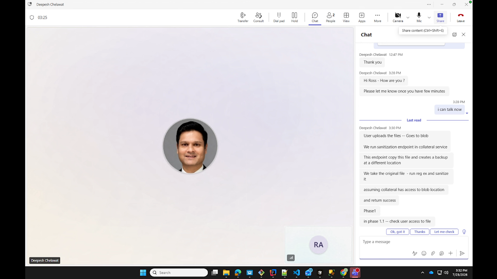
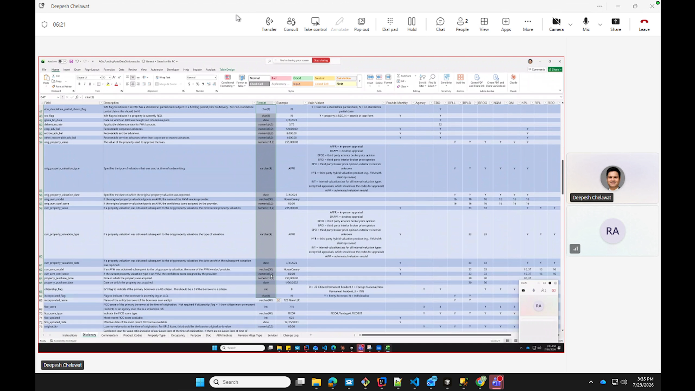
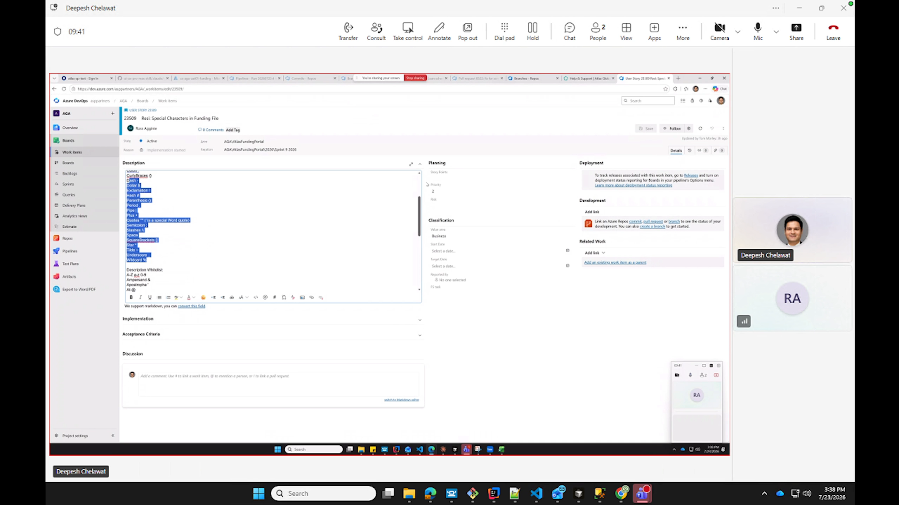
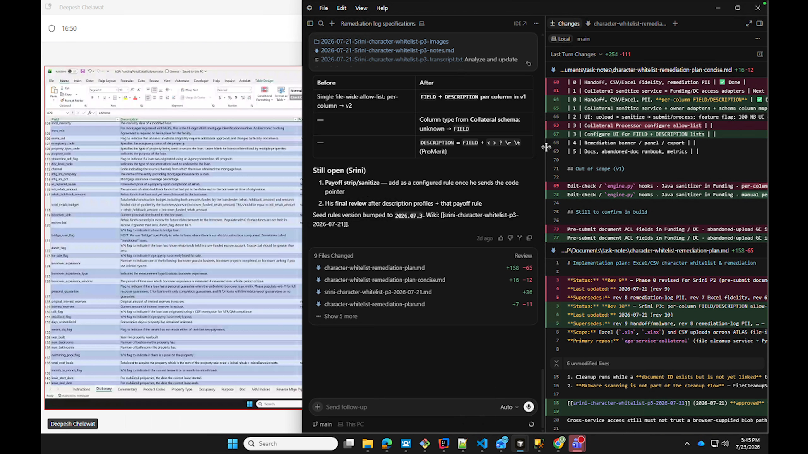
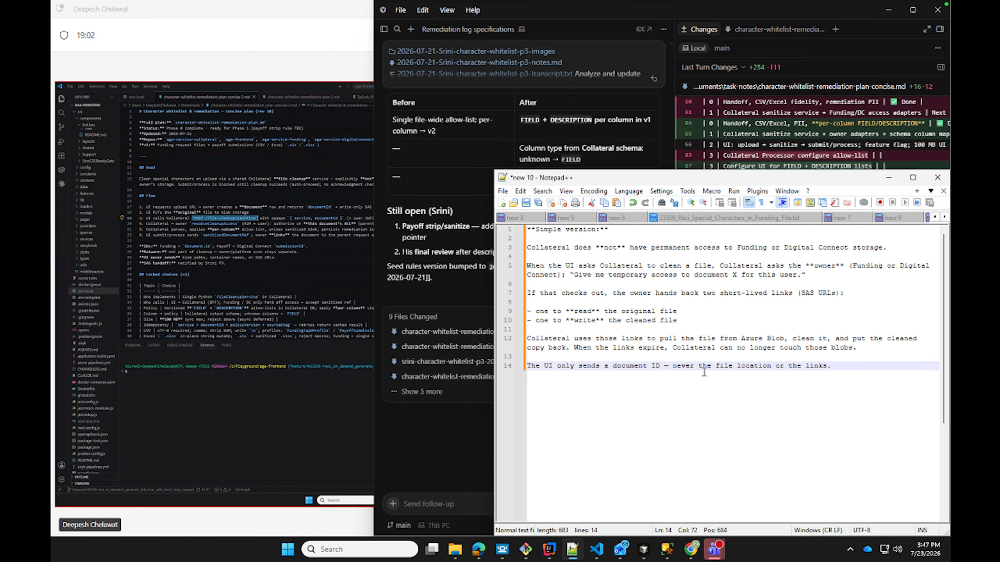
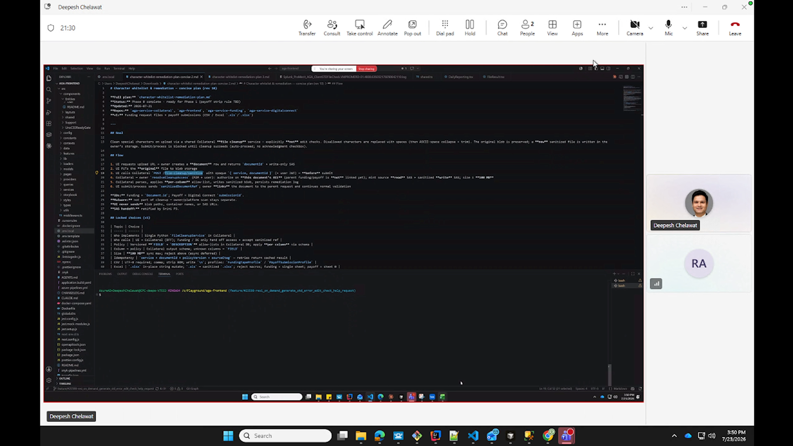

# Deepesh Character Whitelist Part 4

Date: 2026-07-23

Source: `2026-07-23-Deepesh-character-whitelist-p4.mp4`

Participants: Deepesh Chelawat and Ross Agginie

Analyzed scope: 00:00 through 21:16. Later content is omitted per request.

## Main conclusion

The team is ready to begin a vertical implementation slice centered on a shared Collateral sanitization endpoint, but the v1 scope is not fully reconciled. The call converged on configurable per-column rules with a default fallback, an owner-authorized short-lived SAS handoff, a backup before replacement, and UI submission blocked until cleanup succeeds. However, Deepesh repeatedly proposed shipping only the default whitelist first and moving the description profile to a later phase. That conflicts with the Rev 10 plan shown during the call and Srini's prior decision that both `FIELD` and `DESCRIPTION` profiles are required in v1.

This scope conflict, the missing payoff sanitization rule, the exact service-to-service authorization handoff, and minimum audit requirements should be resolved before the implementation is treated as v1 complete.

## Decisions and working agreements

### 1. Collateral owns the reusable sanitizer

- Build a Collateral endpoint that can sanitize an uploaded funding file.
- Treat the sanitizer as the stable core. Funding and Digital Connect provide owner-specific authorization and storage adapters around it.
- Keep the rules configurable in Collateral rather than hard-coding a single regular expression in application logic.

### 2. Cleanup runs before submit

- The user uploads a file to blob storage.
- The UI disables submit while cleanup runs.
- The UI invokes cleanup after upload and enables submit only after successful completion.
- Failure, retry, timeout, and remediation behavior were not fully defined.

### 3. The owner authorizes access

- Checking whether the user can access the facility/document was described as mandatory.
- Collateral should not have permanent access to Funding or Digital Connect storage.
- The file owner should authorize the document and issue short-lived read and write SAS access.
- The UI should identify the document, not supply or select an arbitrary blob path.

### 4. Preserve the existing document reference

- Before sanitization, create a backup of the original.
- Sanitize the existing referenced file so Funding does not need to relink a new document.
- Keep the backup and sanitized copy inside the owner's storage boundary.

### 5. Use schema-backed, per-column configuration

- The funding data dictionary contains the available columns and their data types.
- The discussion estimated about 196 columns.
- Store column rules in a Collateral database table.
- If a column has no explicit record, apply the default `FIELD` profile.
- The design shown on screen maps columns through the Collateral schema and defaults unknown columns to `FIELD`.

## Blocking discrepancies

### Description profile scope

Deepesh proposed using only the default whitelist for the first delivery and deferring description handling. The Rev 10 plan visible in the same call says:

- `FIELD` and `DESCRIPTION` per column are in v1.
- Column type comes from the Collateral schema.
- Unknown columns use `FIELD`.
- `DESCRIPTION` adds `<`, `>`, `?`, carriage return, and tab to the field profile.

No explicit agreement in this recording overrides the Rev 10 decision. Treat description support as a v1 requirement until Srini confirms otherwise.

### Payoff sanitization rule

The plan still lists the existing payoff strip/sanitize behavior as open because the code pointer has not been incorporated. This remains a final-review blocker.

### Authorization route

Two variants were discussed:

1. Funding authorizes and calls Collateral directly.
2. Funding returns SAS access to the UI, which then calls Collateral.

The on-screen design says the UI sends only a document ID and never receives file locations or SAS links. The backend-to-backend handoff is the safer and more consistent interpretation and should be made explicit.

### Logging scope

Deepesh suggested durable logging could wait, with only console counts initially. The displayed plan includes a persisted remediation log. At minimum, v1 needs an auditable record of the document, rule version, result, changed-cell count, timestamps, and failure reason, without logging original sensitive values.

### Schedule

The call referenced both a one-week target for an initial result and a two-week sprint. The expected deliverable and acceptance criteria were not resolved.

## Key insights

- Calling authorization "phase 1.1" is misleading because the same discussion called it mandatory. Do not release a file-mutating endpoint without the owner access check.
- Backup-then-overwrite preserves the existing document ID, but it needs transactional safeguards. Write and validate the sanitized output before replacing the referenced blob, make retries idempotent, and define backup retention and recovery.
- Applying one regex blindly across every cell risks changing numbers, dates, formulas, or workbook structure. Use schema data types and sanitize only eligible string values while preserving Excel/CSV fidelity.
- The assumption that the files do not contain sensitive data is not established. Design access, logs, backups, and diagnostics as if borrower and account data are sensitive.
- A default fallback is useful for unknown columns, but it can silently apply the wrong policy. Emit a safe metric or warning when a column is not mapped.
- Blocking submit on a synchronous cleanup result is simple, but the UI needs explicit timeout, retry, duplicate-request, unsupported-file, and oversize-file behavior.
- The data model should store named profiles and column-to-profile mappings rather than copying a character list into roughly 196 rows. That reduces drift and makes rule-version changes reviewable.

## Recommended v1 acceptance criteria

1. Upload a representative CSV or Excel file and receive a document ID.
2. The owner validates the user's facility/document access.
3. The owner gives Collateral short-lived, document-scoped read/write access through a backend handoff.
4. Collateral creates a recoverable backup, sanitizes eligible string cells, validates the result, and replaces the referenced file without changing the document ID.
5. `FIELD` and `DESCRIPTION` profiles are selected from schema-backed column metadata, with an explicit default for unknown columns.
6. The payoff-specific rule is represented in the same versioned rule system.
7. The UI remains blocked until cleanup succeeds and presents a clear recoverable error on failure.
8. A safe remediation/audit record is persisted without raw cell contents.
9. End-to-end tests cover CSV, Excel, formulas, formatting, line breaks, tabs, unknown columns, retries, authorization failure, cleanup failure, and rollback.

## Action items

- [ ] **Ross and Deepesh:** Confirm with Srini that `FIELD` plus `DESCRIPTION` remains v1 scope. Do not implement default-only behavior as the final v1 contract without an explicit decision.
- [ ] **Srini:** Provide the payoff code pointer and confirm the exact payoff sanitization behavior to preserve.
- [ ] **Deepesh:** Implement the Collateral sanitizer around named, versioned profiles and column-to-profile mappings with a default `FIELD` fallback.
- [ ] **Ross:** Implement Funding and Digital Connect authorization adapters that validate access and hand document-scoped SAS credentials directly to Collateral.
- [ ] **Ross and Deepesh:** Lock the backup, atomic replacement, idempotency, retry, and rollback contract before enabling mutation of uploaded files.
- [ ] **Ross and Deepesh:** Define minimum v1 remediation/audit fields and keep raw file values out of logs.
- [ ] **Product or delivery owner:** Reconcile the one-week preview target with the two-week sprint commitment and publish acceptance criteria.
- [ ] **Team:** Build an end-to-end test through the real upload, cleanup, owner authorization, replacement, and submit flow before calling the work complete.

## Key timestamps

- 00:00: High-level upload, backup, sanitize, and return-success proposal
- 01:14: Phase split; access validation called mandatory and logging deferred
- 02:54: Existing upload-before-submit flow
- 03:14: Disable submit, call cleanup after upload, enable after success
- 04:24: Funding data dictionary and column types
- 06:35: Work item and whitelist rules shared
- 07:15: Default and description whitelist distinction
- 07:58: Proposal to defer description and start with default only
- 08:24: Backup original, then update the referenced file
- 08:44: Unverified no-sensitive-data assumption and minimal logging proposal
- 09:27: Rules must be configurable
- 10:18: Prior per-column database design raised
- 11:51: One-week initial-delivery pressure
- 12:55: Ross cites three prior Srini reviews and the resulting plan
- 14:13: Permanent-access shortcut discussed
- 15:01: Per-column configuration with default fallback
- 15:23: Roughly 196 columns in the data dictionary
- 15:50: Preserve document reference by backing up and replacing in place
- 17:37: Owner-authorized, short-lived SAS design reviewed
- 18:42: Funding access-check endpoint flow
- 20:00: Final per-column table and default-fallback implementation discussion
- 21:08: Proposed work split between Collateral and owner-service endpoints

## Key images

### Proposed upload and cleanup flow at 02:04

### Funding data dictionary at 05:00

### Default and description whitelist ticket at 08:21

### Rev 10 per-column v1 decision and open items at 15:30

### Short-lived SAS access design at 17:42

### Implementation flow at 20:10

## Extracted text and transcript

- Audio transcript: `2026-07-23-Deepesh-character-whitelist-p4-transcript.txt`
- Timestamped transcript: `2026-07-23-Deepesh-character-whitelist-p4-transcript.srt`
- On-screen text: `2026-07-23-Deepesh-character-whitelist-p4-onscreen-text.md`
