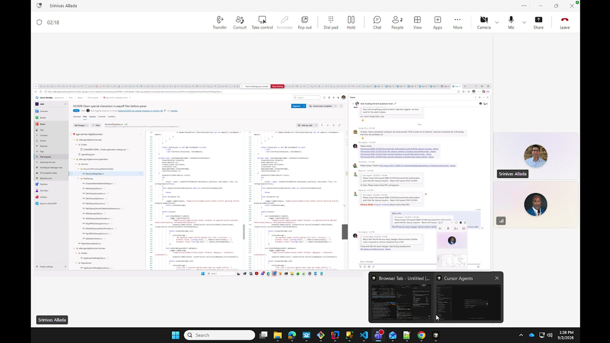
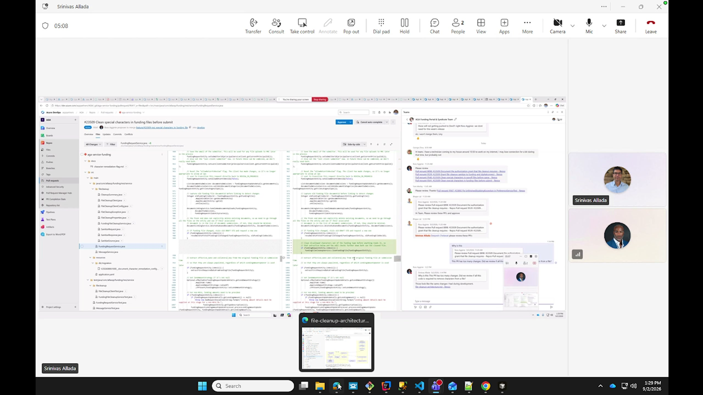
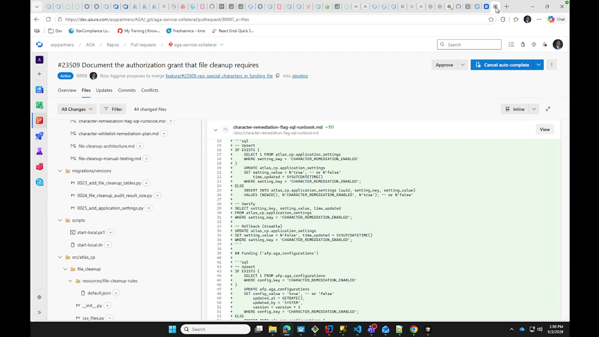
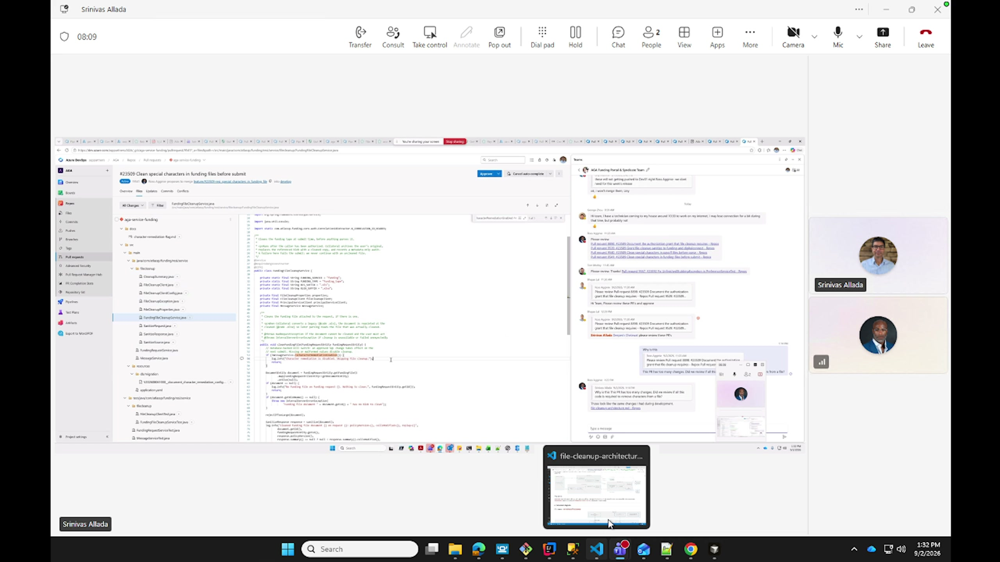
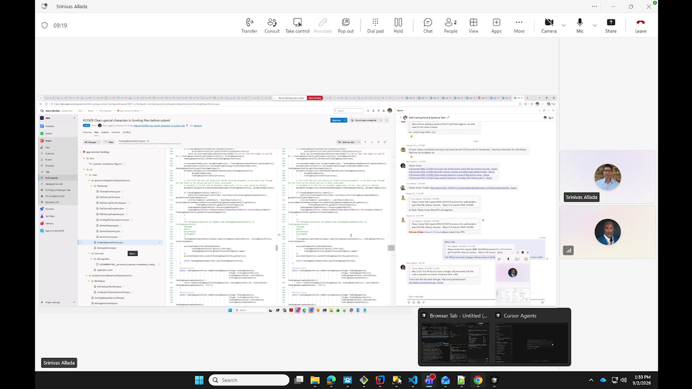
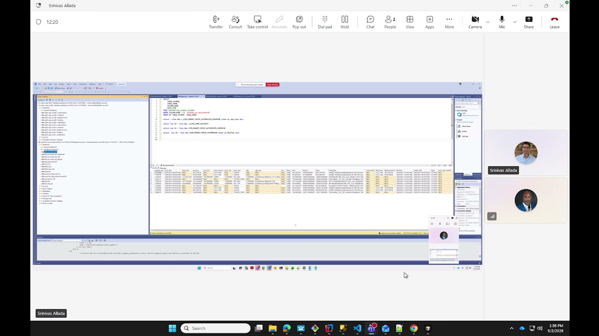
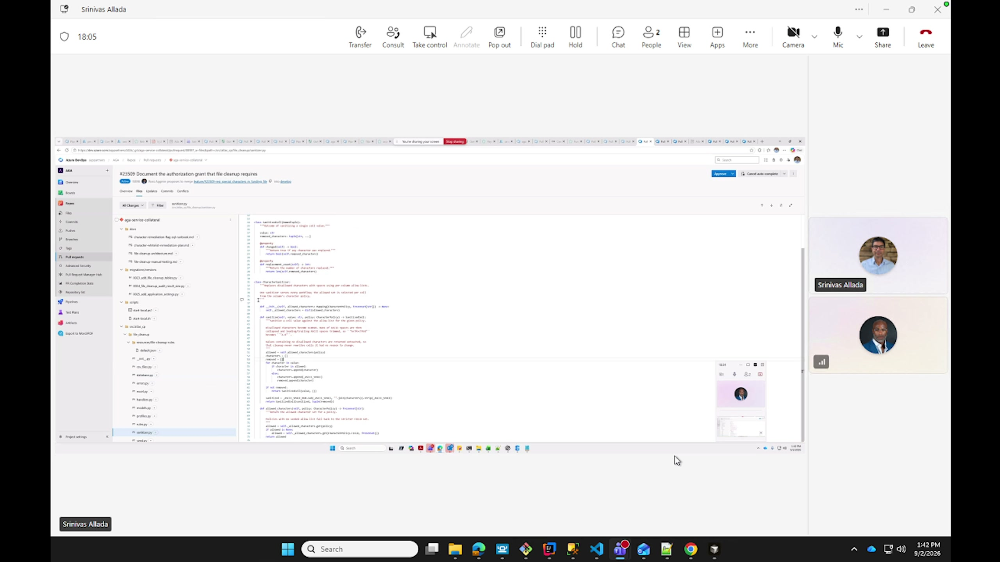
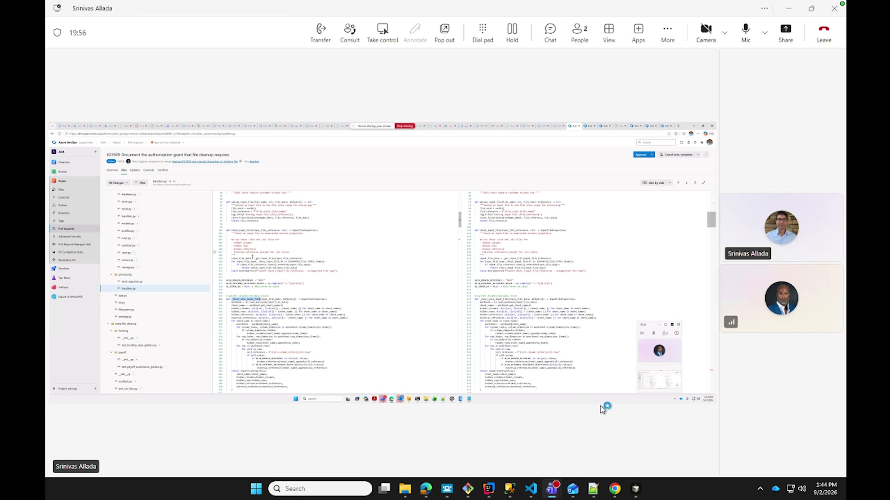
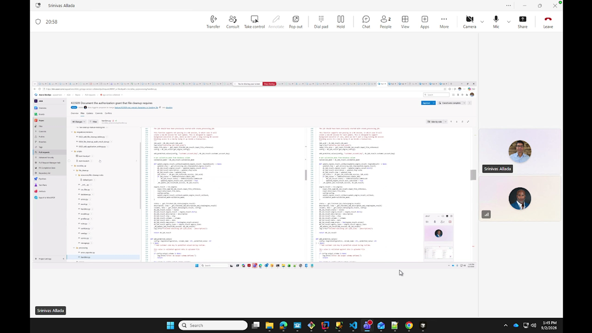
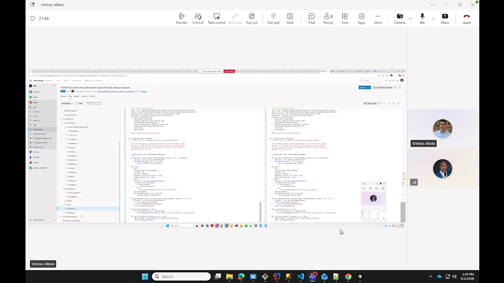

# Srini Character Whitelist Review

Date: 2026-09-02

Source: `2026-09-02-Srini-character-whitelist-review.mp4` (21:05, 2560 x 1440)

Participants: Srini Allada and Ross Agginie. Srini is reviewing the character-remediation implementation across Digital Connect, Funding, and Collateral.

## Main conclusion

Srini is willing to approve the work after the immediate corrections discussed in the call. The main requested correction is to add the database insert or upsert script for `CHARACTER_REMEDIATION_ENABLED` and verify where the flag is consumed. His broader feedback is that the implementation contains too much service-specific and non-reusable code for a capability intended to be shared. He wants cleanup behavior concentrated in the Collateral or Python service, with callers using a much smaller contract.

## Review findings

### 1. Reduce duplicated caller logic

- Digital Connect and Funding appear to carry substantial cleanup orchestration of their own.
- A consumer should make a small call into the common service and let that service own the remaining cleanup work.
- Srini repeatedly questions why calling a REST API requires so much surrounding code and how another service could adopt the feature without duplicating it.
- Generated code still needs a manual review for correctness and unnecessary complexity.

### 2. Fix and verify the feature flag

- Confirm where `CHARACTER_REMEDIATION_ENABLED` is read and how it gates cleanup.
- Add the missing insert or upsert script and document what the flag does.
- The SQL runbook shown in the review covers `atlas_cp.application_settings` for Collateral and `afp.aga_configurations` for Funding, including verification and rollback queries.

### 3. Keep cleanup inside the cleanup service

- Cleanup statistics and related behavior can be returned by the Python service instead of being reconstructed in each caller.
- Whitespace trimming should be represented as a cleanup rule or a small reusable function, not another separately coded path.
- The character-removal function appears narrowly hard-coded. Srini wants the behavior to be more configurable.

### 4. Simplify the XLSX and pandas path

- The current flow converts XLSX input and handles concerns such as broken references and hidden columns.
- Srini notes that the workbook data is already loaded into pandas. Character removal could be a simple method applied there instead of a larger parallel processing path.
- The current approach is described as too much code and not reusable elsewhere.

## Action items

- [ ] Add the insert or upsert script for `CHARACTER_REMEDIATION_ENABLED`.
- [ ] Verify and document every place where the flag is consumed.
- [ ] Simplify the Digital Connect and Funding integrations so the common service owns cleanup behavior.
- [ ] Move cleanup-stat handling into the Python or Collateral service response where practical.
- [ ] Represent trimming as a cleanup rule or one reusable function.
- [ ] Make character-removal behavior configuration-driven rather than fixed to one hard-coded case.
- [ ] Re-evaluate the XLSX flow and reuse the existing pandas data path.
- [ ] Complete the corrections and run through the checklist before final approval.

## Key timestamps

- 00:39: Questions why a REST API call requires so much implementation code.
- 01:05: Asks how another service could adopt the common capability without duplicating code.
- 03:03: Calls for manually reviewing generated code.
- 05:01: Suggests keeping cleanup behavior and statistics in the Python service.
- 05:55: Checks whether `CHARACTER_REMEDIATION_ENABLED` is already used.
- 07:36: Requests the missing flag insert script and an explanation of its purpose.
- 08:36: Says approval is possible, but asks that the amount of code be kept reasonable.
- 10:06: Reviews Collateral cleanup rules.
- 11:04: Questions separately coding whitespace trimming when it is a simple trim operation.
- 16:48: Reviews the fixed character-removal logic and lack of additional configuration.
- 18:18: Reviews XLSX conversion and related workbook concerns.
- 19:38: Suggests applying a simple method after the data is already loaded into pandas.
- 20:08: Concludes that the implementation has too much code and is not reusable.
- 20:32: Agrees to make the discussed corrections and complete the checklist.

## Key images

### Digital Connect cleanup diff at 01:04

### Funding cleanup diff at 03:54

### Character-remediation SQL runbook at 04:53

### Funding cleanup service at 06:55

### Funding file-cleanup changes at 08:05

### Cleanup-rule database inspection at 11:06

### Character-whitelist sanitizer at 16:51

### XLSX processing flow at 18:42

### Existing pandas simplification point at 19:44

### Final code review and corrections at 20:32

## Transcript files

- `2026-09-02-Srini-character-whitelist-review-transcript.txt`: Plain-text automatic transcript.
- `2026-09-02-Srini-character-whitelist-review-transcript.srt`: Timestamped subtitles.
- `2026-09-02-Srini-character-whitelist-review-transcript.vtt`: WebVTT subtitles.
- `2026-09-02-Srini-character-whitelist-review-transcript.json`: Timestamped machine-readable segments and model metadata.

The transcript was produced with local speech recognition and voice-activity detection. Timestamps refer to the original recording. Speaker labels are not available, and a few words remain uncertain because of audio quality and technical names. The findings above use the visible code and earlier project terminology to resolve obvious names such as Collateral, Funding, Digital Connect, XLSX, JSON, and pandas.
